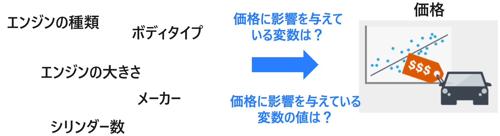

# Handson

### 1. Power BI - Key Influencers による要因探索 (30min)

- [タイタニック号で生き残った乗船顧客の属性は？](Handson/Key-Influencers-titanic-survived.md)

### 2. Automated ML UX によるノーコーディング自動機械学習 (30min)

- [品質管理における不良の予測](Handson/AutoML-UX-factory.md)

### 3. Automated ML Python SDK による自動機械学習とモデル解釈 (60min)

- [品質管理における不良の要因探索](Handson/AutoML-Python-factory.md)

### 4. Try yourself !  (90min)

フリータイムです。自分が興味ある分野を深掘りしてください。

#### Power BI を極めたい人
- タイタニック以外のデータを利用して、同様に要因探索 をやってみる
- フィルタリングやヒストグラムなどを追加して、リッチなレポートを作成する

#### AutoML を極めたい人
- 品質管理以外のデータを利用して、自動機械学習 Automated ML をやってみる
- 最近、時系列モデル (Arima,Prophet) が色々追加されたので、試してみる

#### モデル解釈を極めたい人
- 自分で作ったモデルを解釈してみる
- Microsoft  Interpret ML を試してみる

## サンプルコード
### [自動機械学習 サンプルコード](https://github.com/Azure/MachineLearningNotebooks/tree/master/how-to-use-azureml/automated-machine-learning)
### [モデル解釈 サンプルコード](https://github.com/Azure/MachineLearningNotebooks/tree/master/how-to-use-azureml/explain-model/tabular-data)

    
 

## 分析のシナリオ
### 中古車の価格予測 ([automobile.csv](Sample/data/automobile.csv))

自家用車が中古車としていくらで売れるのか？を予測する機械学習モデルを構築します。

### 顧客離反分析 ([CATelcoCustomerChurnTrainingSample.csv](Sample/data/CATelcoCustomerChurnTrainingSample.csv))

既存顧客の過去の履歴データや属性データを用いて、潜在的な離反顧客を予測する機械学習モデルを構築します。

### 品質管理 ([Factory.csv](Sample/data/Factory.csv))

モノづくりの工程で発生する製造品の不良の要因を分析します。製造工程で生成されるセンサーデータや最終の検査結果データを結合した統合データに対して機械学習を適用します。

### 住宅ローンのデフォルト予測 ([hmeq_ja.csv](Sample/data/hmeq_ja.csv))

顧客の勤続年数や職業から住宅ローンをデフォルトするかを予測する機械学習モデルを構築します。