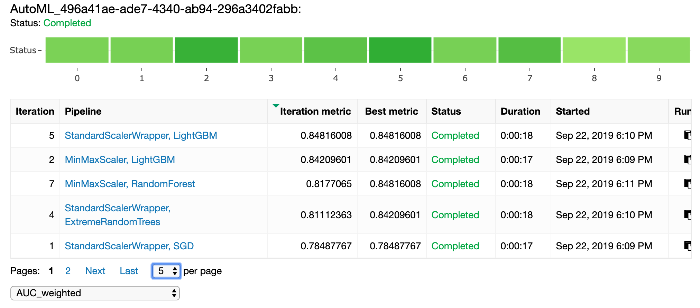
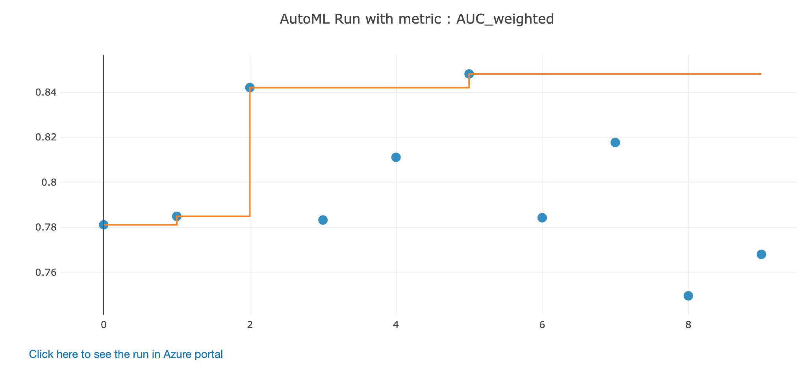

# Automated ML Python SDK による自動機械学習とモデル解釈

製造品の品質を予測する機械学習モデルを構築します。製造工程から取れたIoTデータと製造品の検査結果を学習データにします。

1. Azure Machine Learning service Workspace 接続
2. データのロード
3. Automated ML Python SDK 事前設定と学習
4. 結果の確認
5. モデルの解釈

サンプルの Notebook ([FactoryQC-classification-explainer](../Sample/Automated-Machine-Learning/FactoryQC-classification-explainer.ipynb)) を順番に実行してください。下記に内容を一部抜粋して、説明します。<br/>

---

## 1. Azure Machine Learning service Workspace 接続

Notebook VM を利用している場合には、接続情報が予めキャッシュされているため、下記プログラムで Azure ML service Workspace に接続できます。
```python
from azureml.core import Workspace

ws = Workspace.from_config()
print(ws.name, ws.location, ws.resource_group, ws.location, sep = '\t')
```

ローカルPCのPython環境を利用している場合には、接続情報を明示して実行します。
```python
from azureml.core import Workspace

subscription_id = <サブスクリプション ID>
resource_group =  <リソースグループ名>
workspace_name =  <ワークスペース名>

ws = Workspace(subscription_id, resource_group, workspace_name)
print(ws.name, ws.location, ws.resource_group, ws.location, sep = '\t')
```
<br/>

## 2. データのロード
Azure Machine Learning service に Datasets として登録されているデータをロードし、pandasデータフレームに変換します。

```python
from azureml.core import Dataset
df = Dataset.get(ws, name='Factory').to_pandas_dataframe()
```
<br/>

## 3. Automated ML Python SDK 事前設定と学習

自動機械学習の事前設定を行います。ここでは、分類問題の機械学習を10回のイテレーション(モデル学習)をクロスバリデーションを含めて実行することを意味しています。詳しいパラメータは「[AutoMLConnfig](https://docs.microsoft.com/python/api/azureml-train-automl/azureml.train.automl.automlconfig?view=azure-ml-py)」をご参照ください。
```python
automl_settings = {
    "iteration_timeout_minutes": 5,
    "iterations": 10,
    "n_cross_validations": 3,
    "primary_metric": 'AUC_weighted',
    "preprocess": True,
    "enable_voting_ensemble": False,
    "enable_stack_ensemble": False
}

automl_config = AutoMLConfig(task = 'classification',
                             X = X_train,
                             y = y_train,
                             **automl_settings
                            )
```

submit メソッドで、モデル学習が開始します。

```python
local_run = experiment.submit(automl_config, show_output = True)
```
<br/>

## 4. 結果の確認
Jupyter Widget or Workspace画面にて結果を可視化できます。

```python
from azureml.widgets import RunDetails
RunDetails(local_run).show()
```

<br/><br/>

<br/>

<br/>

## 5. モデルの解釈

Azure Machine Learning Interpretability SDK を利用して、自動機械学習で構築されたモデルの解釈を行います。

```python

from azureml.train.automl.automl_explain_utilities import AutoMLExplainerSetupClass, automl_setup_model_explanations

automl_explainer_setup_obj = automl_setup_model_explanations(fitted_model, X=X_train, X_test=X_test, y=y_train, task='classification')

...(以下略)
```

```python
# ダッシュボード表示
from azureml.contrib.explain.model.visualize import ExplanationDashboard
ExplanationDashboard(raw_explanations, automl_explainer_setup_obj.automl_pipeline, automl_explainer_setup_obj.X_test_raw)
```

モデル全体を見たときに変数の重要度
<br/>

予測値個々の変数の重要度

<br/>
