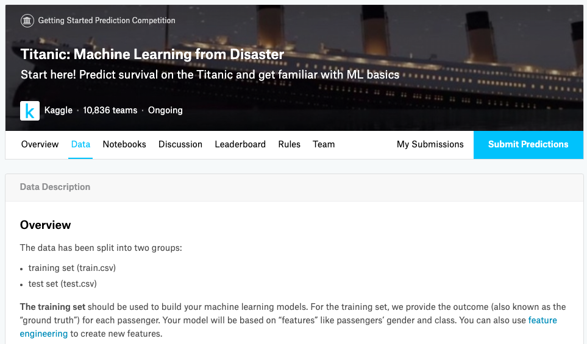
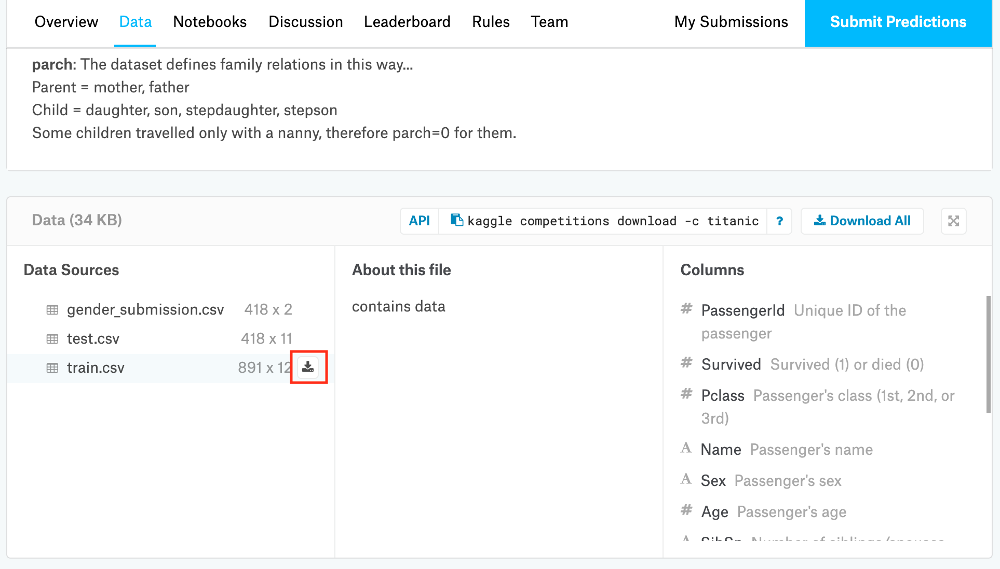

# Power BI - Key Influencers による要因探索

タイタニック号の乗船リストデータを利用して、生き残った乗客の属性を探索します。

## 1. データのダウンロード
[Kaggle : Titanic Machine Learning from Disaster](https://www.kaggle.com/c/titanic/data) からタイタニック号の乗船顧客データをPCにダウンロードします。

  

train.csv をダウンロードします。

  

## 2. データのアップロード
Power BI Desktop を開いて、CSV データをインポートします。

<!--  -->

無事インポートされていることを確認してください。

<!--  -->

  

## 2. データの変換
Key Influencers が利用できるように、"Surviced" 列のデータ形式を **_バイナリ_** に変更します。

  

## 3. Key Influecers 
レポート作成画面に移動し、右上の視覚化から **主要なインフルエンサ**  ( = Key Influencers) を選択します。変数データを下記のようにドラッグ & ドロップで移動します。

  

## 4. 結果の確認

  

## (Option) 5. ダッシュボードの作成
出来上がった画面にフィルターを追加し、性別毎の特徴など、様々な観点で分析してみます。