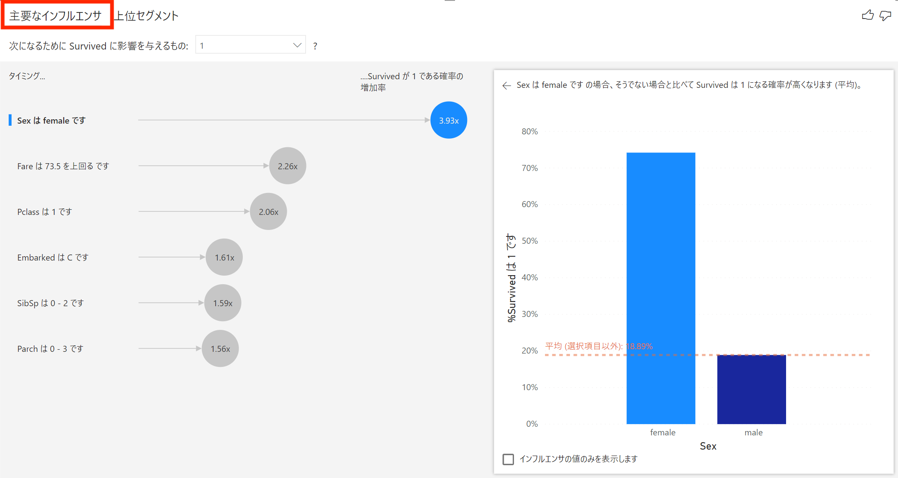
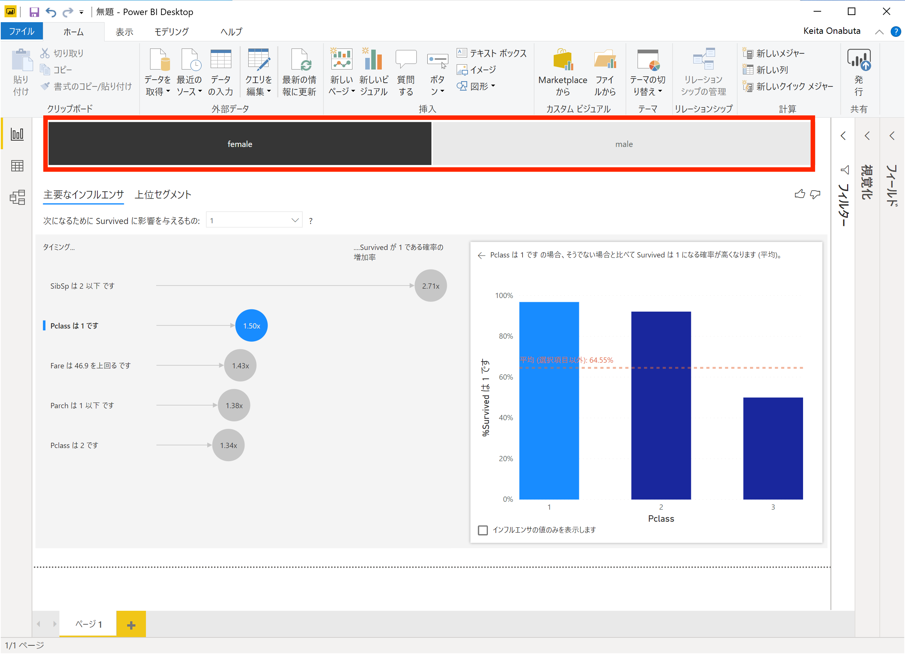

# Power BI - Key Influencers による要因探索

タイタニック号の乗船リストデータを利用して、生き残った乗客の属性を探索します。

## 1. データのダウンロード
[Kaggle : Titanic Machine Learning from Disaster](https://www.kaggle.com/c/titanic/data) からタイタニック号の乗船顧客データをPCにダウンロードします。

  

train.csv をダウンロードします。

  

## 2. データのアップロード
Power BI Desktop を開いて、CSV データをインポートします。対象のファイルを選択します。

  

"読み込み" をクリックして、インポートします。
  

  

## 2. データの変換
Key Influencers が利用できるように、"Surviced" 列のデータ形式を修正します。

左のデータタブにアクセスし、**クエリを編集** を選択します。
  

Survived 列のデータ形式を **テキスト** に編集します。
  

**新規手順の追加** を選択します。

  

Survived 列のデータ形式がテキストに変更されて、**適用したステップ** にて "変更された型1" が追加されていることを確認します。

  

**閉じて適用** をクリックして、データに適用させます。

  

  

## 3. Key Influecers 
レポート作成画面に移動し、右上の視覚化から **主要なインフルエンサ**  ( = Key Influencers) を選択します。変数データを下記のようにドラッグ & ドロップで移動します。

  

データをフィールドからドラッグ&ドラップで移動します。**分析** にところには、Survivced 列を持ってきます。説明の所には任意のもので構いません。

  

  

## 4. 結果の確認
**主要なインフルエンサ** の結果を確認します。下記のように生存有無に大きく影響する単一の変数とその値の範囲が導出されます。ここでは回帰の手法が用いられています。

  

**上位セグメンント** の結果を確認します。特徴的なセグメントが表示されます。一番生存確率が低いセグメントをクリックします。

  

下記のように生存有無に大きく影響する複数変数の組み合わせが導出されます。ここでは決定木の手法が用いられています。

  

  

## (Option) 5. ダッシュボードの作成
出来上がった画面にフィルターを追加し、性別毎の特徴など、様々な観点で分析してみます。

例えば性別のフィルターを追加すると、下記のようなダッシュボードが完成します。

  
