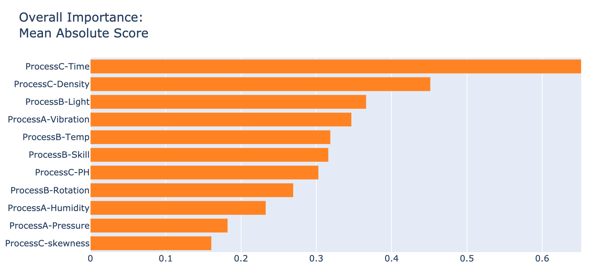
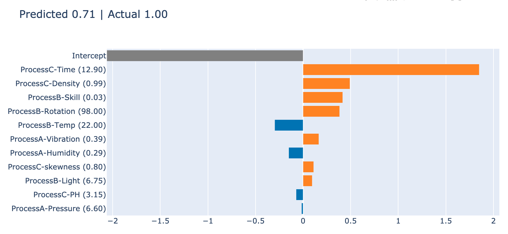

# Microsoft InterpretML

Microsoft Research が開発している、解釈可能な一般化加法モデルをベースにした機械学習アルゴリズムです。

**GitHub Repo** : [Interpret ML - Alpha Release](https://github.com/microsoft/interpret)

モデル全体での説明変数の重要度 (グローバル) と、個々の予測値に対する説明変数の重要度 (ローカル) の両方に対応している。

 

  

*例 1：グローバルなモデル解釈の例 (モデル全体の説明変数の重要度)*
  

*例 2 : ローカルなモデル解釈の例 (あるテストデータに対する解釈。不良確率 71.1% : オレンジは不良確率の増加、青は不良確率の減少を意味。)*
