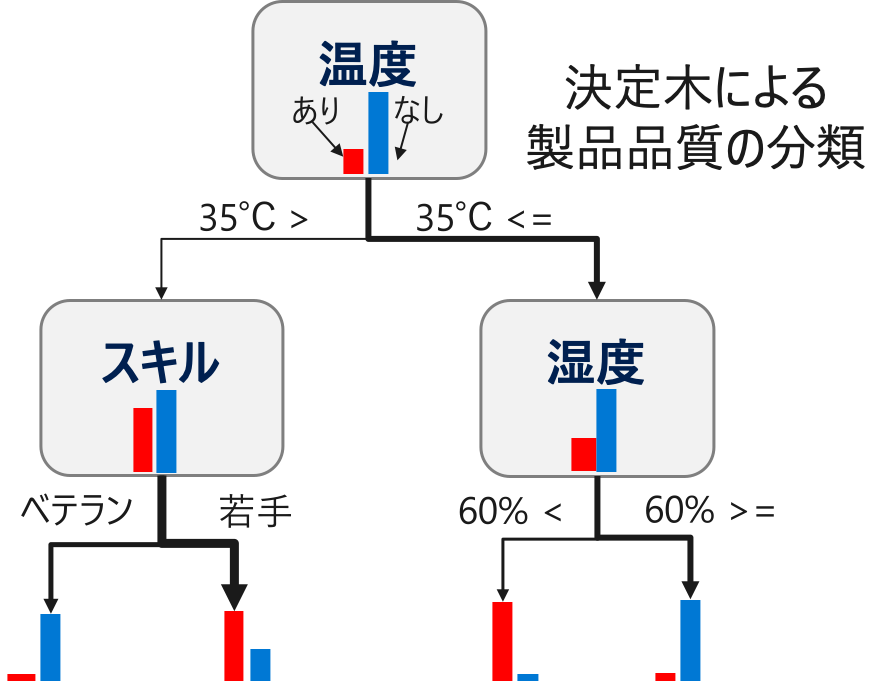
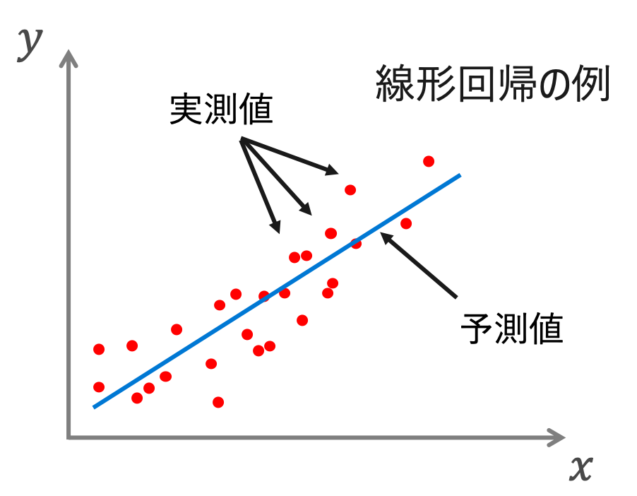
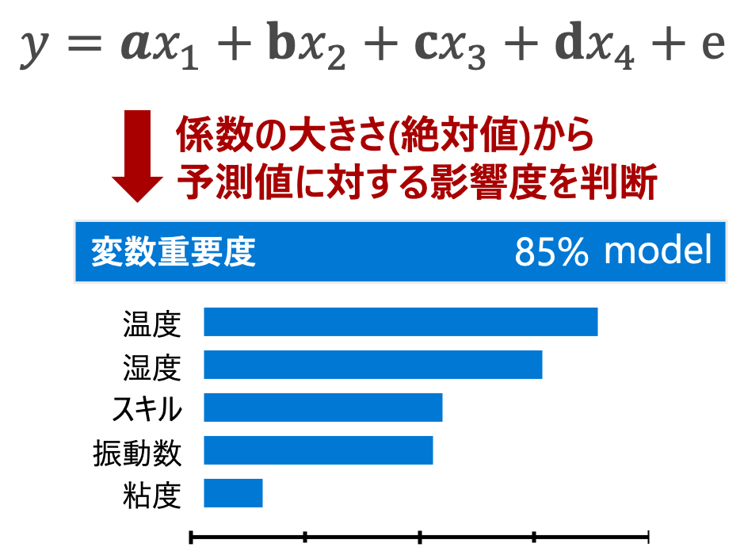

# Interpretable Algorithms

解釈可能な機械学習モデルを利用するアプローチです

### 従来の統計解析のモデル
- Decision Tree (決定木)
- Linear Regression (線形回帰)
<!-- - GLM (一般化線形モデル) -->

 

# Decision Tree (決定木)

説明変数をある基準に基づいて条件分岐させていくことで予測値を算出するモデルを構築します。

下記に例を示します。普段の不良の確率が20%程度のデータを想定します。

 

  

 
 

このデータに対して決定木を適用すると、下記のような木構造のモデルが学習されて出力されます。

 

  

例えば、**「温度が35℃以上」&「湿度が60%以上」** であれば不良の割合がかなり多いことがわかります。一方、**「温度が35℃以下」&「スキルがベテラン」** の場合は不良の割合が少ないです。

このように決定木は、どういった条件で予測値が算出されるのかが明確なので、解釈性のあるモデルです。

 

# Linear Regression (線形回帰)

説明変数とターゲット変数(予測対象変数)の関係を線形で表現するモデルを構築します。

 

線形回帰の式 (下記参照)) を算出し、その変数の大きさを見て、予測値との関係性を見ています。変数の重要度とも呼ばれます。

 

 

線形回帰は、説明変数に重みをつけたデータを足し合わせて予測値を出力するので、シンプルな解釈可能モデルの１つです。変数の重要度が分かれば予測値に影響している変数もわかってきます。

 

<!-- # 一般化線形モデル (工事中) -->
<!-- 
# Microsoft 

* **_[Power BI - Key Influencers](PowerBI.md)_** ... 可視化ツール Power BI の KPI 探索機能。マウス操作で、統計解析のモデルを利用した要因探索が可能。
* **_[Microsoft Interpret ML](InterpretML.md)_** ... Microsoft Researchが開発した解釈可能な機械学習モデルが利用できるフレームワーク。
* **_カスタム Python & R_** ... ユーザ自らアルゴリズムを構築するアプローチ。Azure Machine Learning を利用すると効率的にモデル開発作業を進めることができます。 -->

