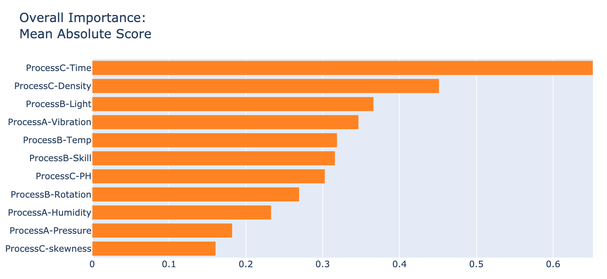

# Interpretable Algorithms

解釈可能な機械学習モデルを利用するアプローチです。大きく2通りあります。
- 従来の統計解析手法のモデル
- 精度が高く解釈可能なモデル

### 従来の統計解析のモデル
- Decision Tree (決定木)
- Linear Regression (線形回帰)
- GLM (一般化線形モデル)

### 精度が高く解釈可能なモデル
- Microsoft Interpret ML

 

## Sample Code

下記の表には、"Interpretable Algorithms" のサンプルコードをリストしています。Environment列のリンクからアクセスできます。

| Algorithm | Environment | Type | Description | 
| --- | --- | --- | --- |
| Decision Tree | [Python](Samples/Decision-Tree) | Statistics | Decision Tree (決定木) を用いたモデル開発のサンプルコード| 
| Linear Regression | [Python](Samples/Linear-Regression) | Statistics | Linear Regression (線形回帰) を用いたモデル開発のサンプルコード| 
| Microsoft InterpretML | [Python](Samples/Interpret) | Microsoft Research | Microsoft Interpret ML によるモデル開発のサンプルコード| 

 

---

# Decision Tree (決定木)

説明変数をある基準に基づいて条件分岐させていくことで予測値を算出するモデルを構築します。

下記に例を示します。普段の不良の確率が下記のように20%未満のデータを想定します。

 

  

 
 

このデータに対して決定木を適用すると、下記のような木構造のモデルが学習されて出力されます。

 

  

例えば、「温度が35℃以上」&「湿度が60%以上」であれば不良の割合がかなり多いことがわかります。一方、「温度が35℃以下」&「スキルがベテラン」の場合は不良の割合が少ないです。

このように決定木は、どういった条件で予測値が発生するのかが明確なので、非常に解釈性のあるモデルです。

 

# Linear Regression (線形回帰)

説明変数とターゲット変数(予測対象変数)の関係を線形で表現するモデルを構築します。

 

統計解析では線形回帰の式 (下記参照)) を算出し、その変数の大きさを見て、予測値との関係性を見ていました。変数の重要度とも呼ばれます。

 

 

線形回帰は、説明変数に重みをつけたデータを足し合わせて予測値を出力するので、シンプルな解釈可能モデルの１つです。変数の重要度が分かれば予測値に影響している変数もわかってきます。

 

<!-- # 一般化線形モデル (工事中) -->

# Microsoft InterpretML

解釈可能な一般化加法モデルをベースにしたアルゴリズム。 

**GitHub Repo** : [Interpret ML - Alpha Release](https://github.com/microsoft/interpret)

モデル全体での説明変数の重要度 (グローバル) と個々の予測値に対する説明変数の重要度 (ローカル) の両方に対応している。

 

  

*グローバルなモデル解釈の例 (モデル全体の説明変数の重要度)*
  

*ローカルなモデル解釈の例 (不良確率 71.1% : オレンジは不良確率の増加、青は不良確率の減少を意味)*

