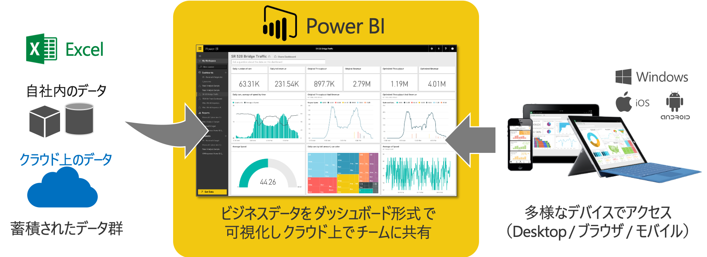

# Power BI

Power BI は、エンタープライズまでスケール可能な **セルフサービス BI**サービスです。膨大なデータに対して、簡単なマウス操作で、傾向を分析＆“見える化”し重要な気づきを発掘することができます。

 

*2019年 Gartner「Magic Quadrant for Analytics and Business Intelligence Platforms」において Leader に選出されています。*
  

## Key Influencers

Key influencers は、データに存在する KPI の要因探索を実現するビジュアル機能です。

  

- ユースケース
   - 顧客が離反する要因の分析
   - 設備が故障する原因分析や故障の種類識別
   - 売り上げが減少した外部環境の分析
   - ローン審査で延滞する可能性があると判断された理由の分析

裏の分析エンジンは ML.NET が提供する**回帰**や**決定木**の機械学習アルゴリズムが使用されています。ユーザーはマウス操作のみで高度なアルゴリズムにアクセスし、分析することができます。

*※ 内部アルゴリズムの詳細は[こちら](https://dotnet.microsoft.com/apps/machinelearning-ai/ml-dotnet/customers/power-bi
)*