# Setup
ハンズオンに必要な環境のセットアップ方法を記載します。

## Table of Content
 - [Power BI Desktop](#power-bi-deskop)
 - [Azure Machine Learning service](#azure-machine-learning-service)
    1. [ワークスペース](#1-ワークスペース)
    2. [Compute Target](#2-compute-target)
    3. [Python SDK 環境](#3-python-sdk-環境)
    4. [コードのインポート](#4-コードのインポート)
- [Option](#Option)
    - [Microsoft Interpret ML](#microsoft-interpret-ml)

## Power BI Deskop
Power BI Desktop は無料で利用できる可視化ツールです。  

下記リンクより、Microsoft ストアから Windows アプリとしてインストールでできます。  
http://aka.ms/pbidesktopstore

※ Widnowsストア経由でインストールされた Power BI Desktop は、自動更新機能によって常に最新バージョンをご利用になれます。

<br/>

## Azure Machine Learning service
Azure Machine Learning service は機械学習のモデル学習、デプロイ、運用管理をサポートするクラウドベースの機械学習の統合プラットフォームです。

### 1. ワークスペース

- [Azure Portal](https://portal.azure.com/) へアクセスします。
- 画面左上の**リソースの作成** を選択します。  
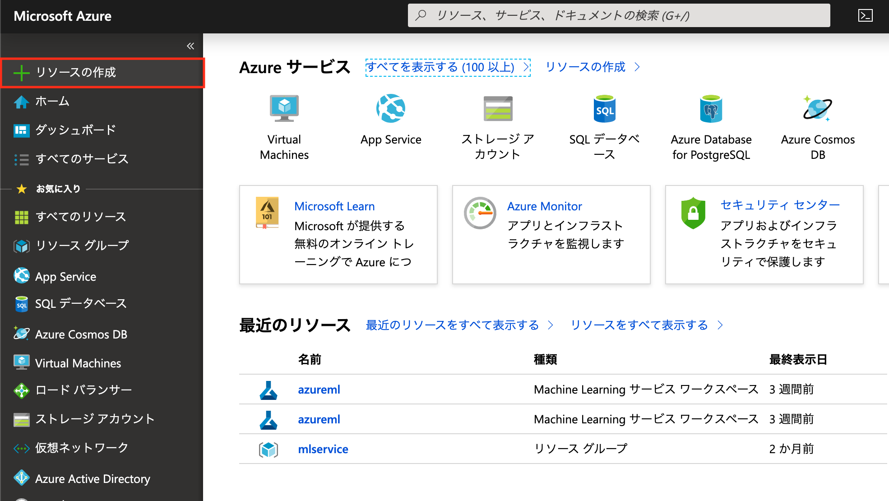

- 検索バーにて、**machine learning service workspace** と入力します。  
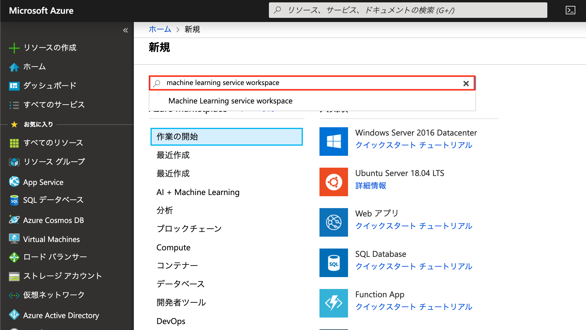 

- *Machine Learning service workspace* を選択し、**作成** をクリックします。
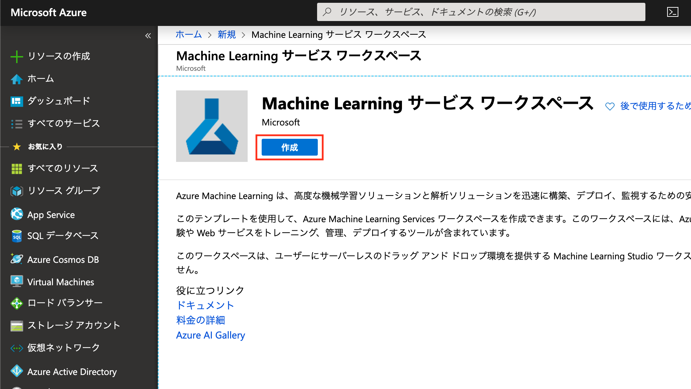 

- 各種情報を入力します。  
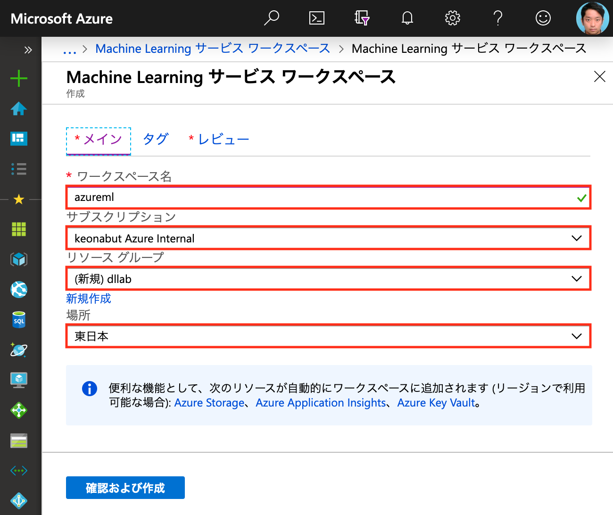 

|Item|Value|
|------------- |----------------|
| ワークスペース名 | _任意の3~33文字のアルファベット・数値とハイフンで Okay_|
|サブスクリプション| _利用するAzure Subscriptionを選択_|
|リソースグループ  |_Azure ML 用に新規に作成することをオススメ_|
|場所|_任意のRegion_|

- **確認および作成** をクリックし、レビュー画面にて **作成** を選択します。
- 無事デプロイが完了したら、**リソースに移動** します。  
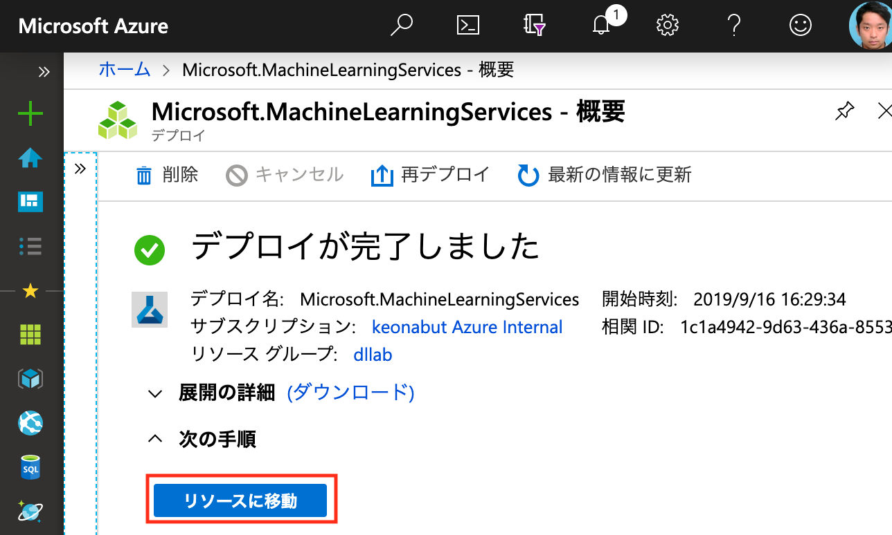 

- Azure Machine Learning service ワークスペースの画面が表示されたら完了です。
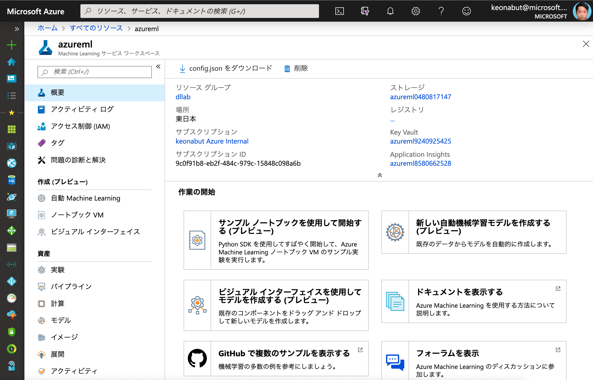 

- また、プレビュー中（2019年10月6日時点）のワークスペース画面にも、下記リンクからアクセスできることを確認してください。  <br/>    
**New Workspace Experience**  
https://ml.azure.com/workspaceportal   
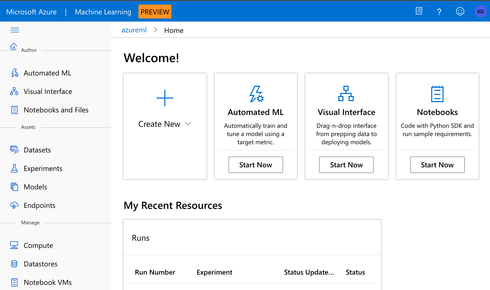 

<br/> 


### 2. Compute Target
機械学習のトレーニングを回すための計算環境 (Machine Learning Compute) を設定します。
Workspace の画面の左パネルの **_Compute_** から、計算環境を作成していきます。

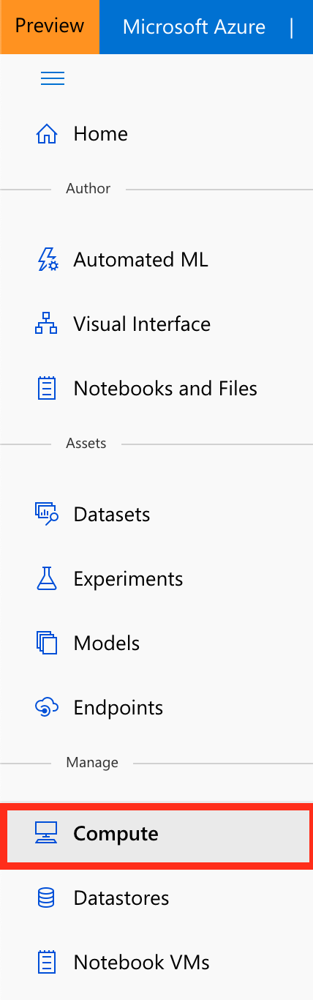 

**Add** して、新規で計算環境を構築します。

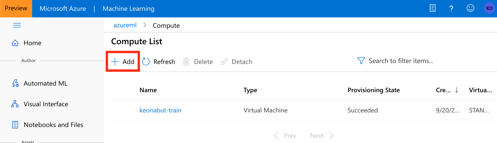<br/>

**cpucluster** という名称で、Compute Type は **Machine Learning Compute** を選択します。Machine Learning は機械学習用に Pre-Built された PaaS で提供される計算環境です。

※ VMも選択可能だが、スケールしないため通常は Machine Learning Compute を利用

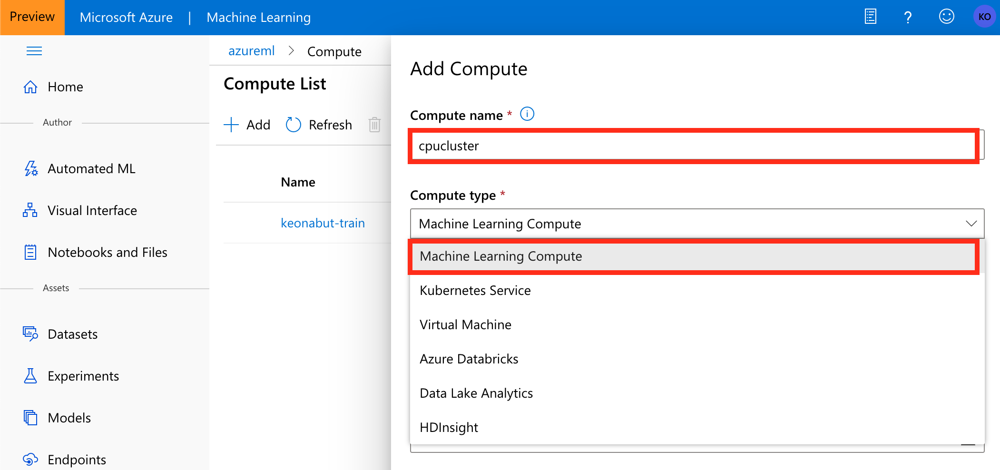<br/>

VMの種類やノードの設定を行います。下記画面を参考に選択してください。設定が完了したら、Create を押して環境作成を開始します。

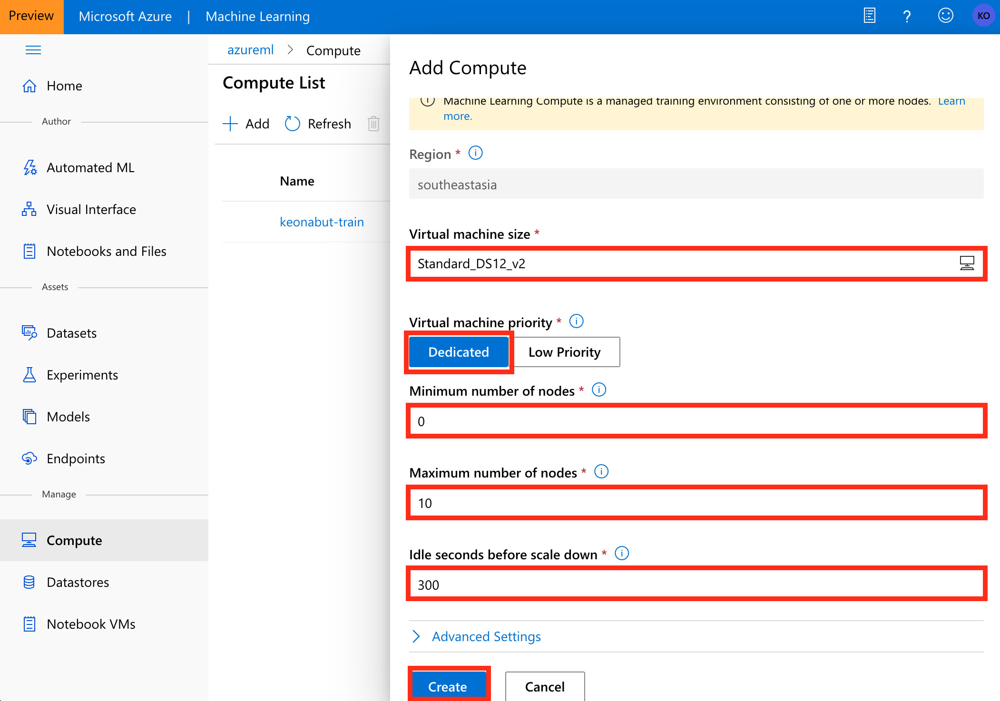<br/>

計算環境の作成が無事終わったことを確認します。

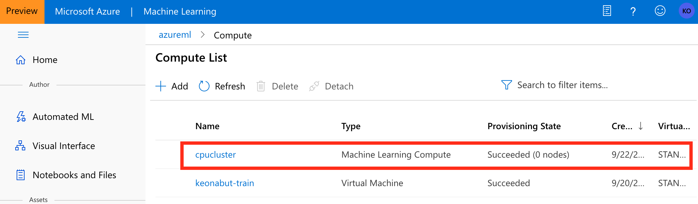<br/>

### 3. Python SDK 環境
Python 環境としては、Notebook VM の利用を推奨しています。ただローカルPCの Python 環境からも Azure Machine Learning service にアクセスすることができます。A, B のいずれかの手順を実行してください。

#### A. Notebook VM

Notebook VM は、 Azure Machine Learning service が提供するマネージドな Jupyter Notebook / Jupyter Lab 環境です。

自分の Notebook VM を作成する際は、左パネルの **Notebook VM**機能にアクセスし、**New**をクリックします。
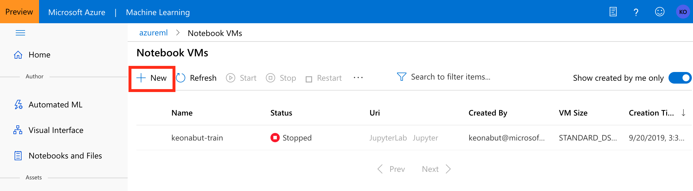<br/>

任意の名称とVMのスペックを選択して、作成を開始します。
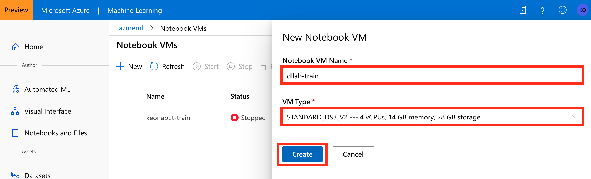<br/>

|Item|Value|
|------------- |----------------|
|Notebook VM Name|_Regionで一意となる名称が必要_|
|VM  Type|_任意のスペックから選択可能 (CPU,GPU)_|

Status が **Running** になっていることを確認し、**Jupyter** をクリックして、Jupyter Notebook にアクセスできることが確認できれば完了です。

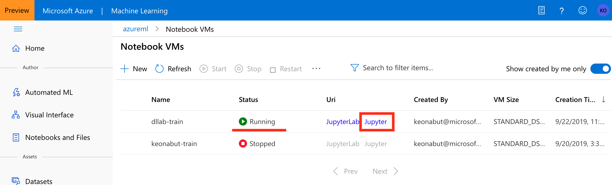<br/>

<br/>

#### B. ローカル PC の Python 環境

1. [Miniconda](https://docs.conda.io/en/latest/miniconda.html) もしくは [Anaconda](https://www.anaconda.com/distribution/) をインストールします。

2. Anaconda Prompt を開いて、_**myenv**_ という名前の仮想環境を作成します。

```bash
# New Conda
conda create -n myenv Python=3.6
# Activate 
conda activate myenv
```

3. Azure Machine Learning service Python SDK をインストールします。
```bash
# Package Install
pip install --upgrade azureml-sdk[notebooks,automl,explain,contrib] azureml-dataprep
```

4. Jupyter Notebook をインストールし、カーネルを有効化します。
```bash
# Install Jupyer Notebook
conda install notebook ipykernel
```

```bash
# Jupyter Kernel Attach
python -m ipykernel install --user --name myenv --display-name myenv
```
```bash
# Start Jupyter Notebook
jupyter notebook
```

次の Python プログラムで正常に Azure Machine Learning service Python SDK がインポートできたか確認できれば完了です。

```python
import azureml.core
azureml.core.VERSION
```

### 4. コードのインポート
ハンズオンで利用するコードをインポートします。利用する Python 環境に応じて、A, B のいずれかの手順を実行してください。

#### A. Notebook VM

Notebook VM には Git がインストール済みのため、その Git コマンドからインポートします。

Jupyter Notebook の Terminal を開きます。自分の個人フォルダーに移動し、本リポジトリをクローンします。

```bash
cd <個人フォルダ>
git clone https://github.com/konabuta/DataExplore-Workshop
```
<br/>

#### B. ローカル PC の Python 環境

下記のいずれかの方法でローカルPCにインポートします。

A. [Git](https://gitforwindows.org/) or [GitHub Desktop](https://desktop.github.com/) がインストールされている場合は、ローカルPCの作業フォルダにて、本リポジトリをクローン
```bash
# git コマンドの例
git clone https://github.com/konabuta/DataExplore-Workshop
```
B. 本リポジトリの [Zip ファイル](https://github.com/konabuta/DataExplore-Workshop/archive/master.zip) をダウンロードし、ローカルPCの作業フォルダで解凍する　

<br/>

## Option
### Microsoft Interpret ML
[Microsoft Interpret ML](https://github.com/microsoft/interpret) のライブラリを利用する際には、Azure Machine Learning service とはパッケージの競合を防ぐため、Azure ML service  Python SDK とは別の仮想環境を利用することを推奨します。

1. Anaconda Prompt を開いて、interpretという名前の仮想環境を作成します。

```bash
# New Conda
conda create -n interpret Python=3.6
# Activate 
conda activate interpret
```

2. Microsoft Interpret ML をインストールします。
```bash
# Package Install
pip install interpret
```

3. Jupyter Notebook をインストールし、カーネルを有効化します。
```bash
# Install Jupyer Notebook
conda install notebook ipykernel
```

```bash
# Jupyter Kernel Attach
python -m ipykernel install --user --name interpret --display-name interpret
```
```bash
# Start Jupyter Notebook
jupyter notebook
```